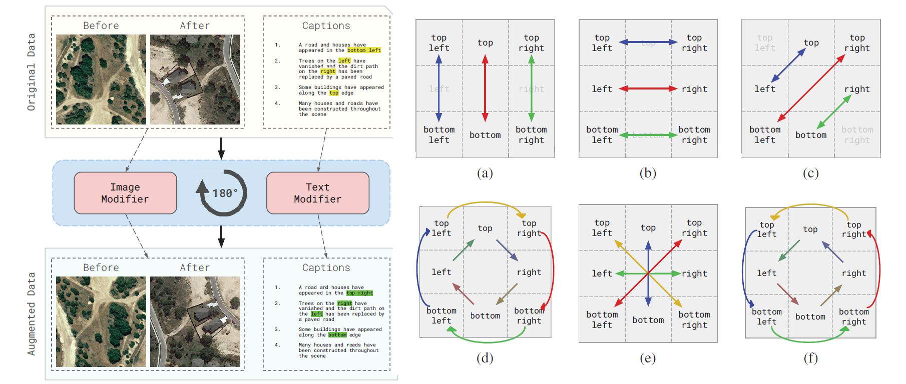

<div align="center">

<h1><a href="[https://ieeexplore.ieee.org/document/9934924]">Data Augmentation in Remote Sensing Image Change Captioning</a></h1>

**[Orkhan Karimli], [Ilyas Mustafazade], [Ali Can Karaca](https://scholar.google.com.tr/citations?user=KVU5O6gAAAAJ&hl=tr&authuser=1), and [M. Fatih Amasyali](https://scholar.google.com.tr/citations?hl=tr&authuser=1&user=qTUSAy0AAAAJ)**

</div>

This repository contains the implementation of the augmentation methods from the *"Data Augmentation in Remote Sensing Image Change Captioning"* conference paper. For more information, please see our published paper in [[IEEE]([https://ieeexplore.ieee.org/document/9934924](https://ieeexplore.ieee.org/document/9934924))]  ***(in IEEE International Conference on Computer Science and Engineering (UBMK2024))***



## Requirements

This repository was developed using **Python 3.10 and above.**
The following [installation](#installation) instructions uses
**[`pip`](https://pip.pypa.io/en/stable/installation/)**
(and, optionally, [`venv`](https://packaging.python.org/en/latest/guides/installing-using-pip-and-virtual-environments/)).

## Installation

1. Clone the repository:

    ```bash
    git clone https://github.com/ChangeCapsInRS/Data-Augmentation-in-RSICC.git
    cd Data-Augmentation-in-RSICC
    ```

1. (Optional, but highly recommended) Create and activate a virtual environment:

    ```bash
    python -m venv venv
    source venv/bin/activate  # On Windows use `venv\Scripts\activate`
    ```

1. Install the dependencies:

    ```bash
    pip install -r requirements.txt
    ```

## Usage

### Data Preparation

The augmentation pipeline in this repository is implemented with the LEVIR-CC dataset in mind. You can download LEVIR-CC using the resources provided [here](https://github.com/Chen-Yang-Liu/LEVIR-CC-Dataset). You may save the JSON file or the top folder containing all the image pairs, i.e., `images`, from the dataset in directories of your choice. In the following examples, we assume the JSON file containing the captions and the `images` folder are located in `path/to/captions.json` and `path/to/images`, respectively.

#### Resplit and Preprocess

In the paper, we operate on a resplit and preprocessed version of the LEVIR-CC dataset. To achieve the same effect:

```bash
python -m src.preprocess --captions path/to/captions.json --images path/to/images \
    --train_amount 25 --validation_amount 25 --test_amount 50 --output levircc_25_25_50
```

> [!WARNING]
> Beware that the script used above is really demanding in terms of disk usage.

The command above saves the resulting dataset in `./levircc_25_25_50` in the following tree directory structure:

```tree
levircc_25_25_50
            ├─LevirCCcaptions.json
            └─images
              ├─train
              │  ├─A
              │  └─B
              ├─val
              │  ├─A
              │  └─B
              └─test
                 ├─A
                 └─B
```

The script also allows for the configuration of parameters, such as the split ratios of the final dataset. To see all the options regarding preprocessing:

```bash
python -m src.preprocess -h
```

### Data Augmentation

To augment the train and validation splits of a dataset:

```bash
python -m src.augment -i path/to/images -j path/to/captions.json \
-o augmented/dataset --augmenter-names AUGMENTER_NAMES
```

`AUGMENTER_NAMES` above is a space-separated list of the augmenter names to use.
Different image pairs and JSON files are generated for each augmentation method in the list.
The generated images and JSON files are then combined under `augmented/dataset/images` and
`augmented/dataset/merged.json` directories, respectively. You can use these paths in
place of `path/to/images` and `path/to/captions.json` when working with the image change
captioning approach of your choice.

To see the list of available augmenter names, along with other options for the augmentation
script:

```bash
python -m src.augment -h
```

<details>
<summary><code>AUGMENTER_NAMES</code> for data augmentation methods from paper</summary>


$\mathrm{brighten}$: `brighten_both`

$\mathrm{blur}$: `blur`

$\mathit{mirror}$: `horizontal_mirror vertical_mirror left_diagonal_mirror`

$\mathit{rotate}$: `rotate_90 rotate_180 rotate_270`

$\mathrm{hybrid}$: `random_augment`

</details>

<details>
<summary>Custom Directional Phrases</summary>

This section focuses on multimodal data augmentation techniques that utilize directional phrases such as "left," "right," "top," and "bottom," along with their combinations, to align captions with their corresponding image pairs.

In some datasets, the areas corresponding to the top and bottom of the image frame may be referred to using various terms. For example, "top" can also be described as "upper," "above," "higher," while "bottom" may be referred to as "lower," "below," "bottommost," or "lowest." To accommodate these variations, you can modify the definitions of the `BOTTOM_DIRECTIONS` and `TOP_DIRECTIONS` constants in the [augmentation_methods.py](src/augmentation_methods.py) file:

```diff
 BOTTOM_DIRECTIONS = (
     "bottom",
-    # "lower",
-    # "below",
-    # "bottommost",
-    # "lowest",
+    "lower",
+    "below",
+    "bottommost",
+    "lowest",
 )

 TOP_DIRECTIONS = (
     "top",
-    # "upper",
-    # "above",
-    # "topmost",
-    # "highest",
-    # "higher",
+    "upper",
+    "above",
+    "topmost",
+    "highest",
+    "higher",
 )
```

When a sentence contains any of the tokens listed above (along with "left" and "right"), it will be replaced with either `BOTTOM_DIRECTIONS[0]`, `TOP_DIRECTIONS[0]`, `"left"`, `"right"`, or a combination of these, depending on the image transformation applied.

</details>

## Running Tests

To run tests, run the following command

```bash
  pytest
```

<!--
## Citation

If you find this repository or the paper helpful, please consider citing:

```bibtex
...
```
 -->
